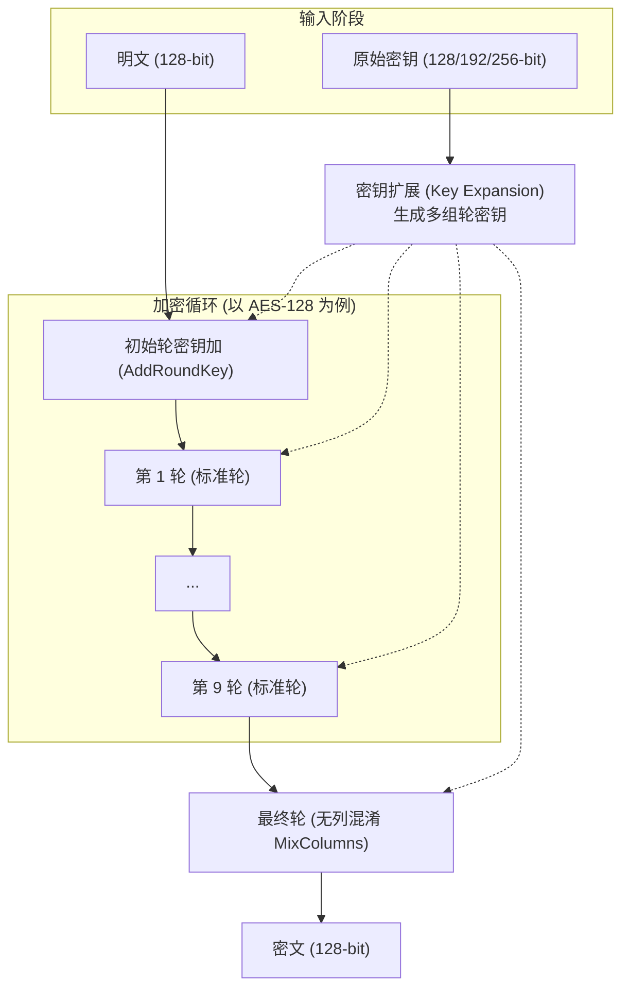
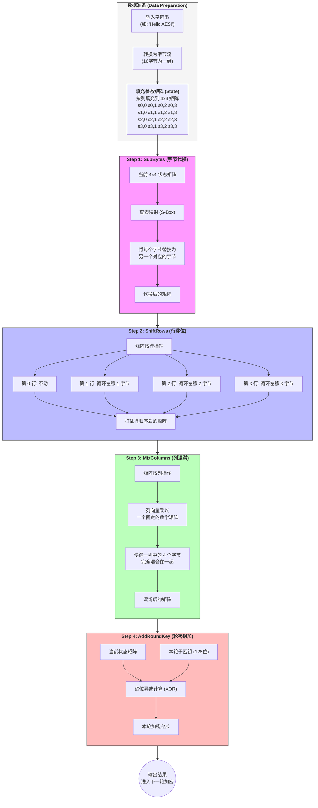
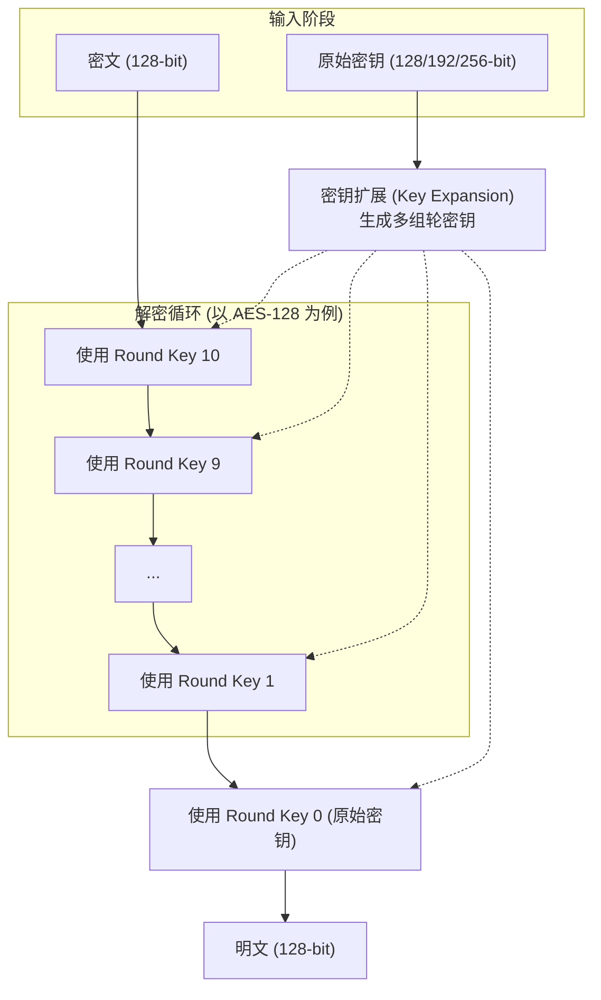
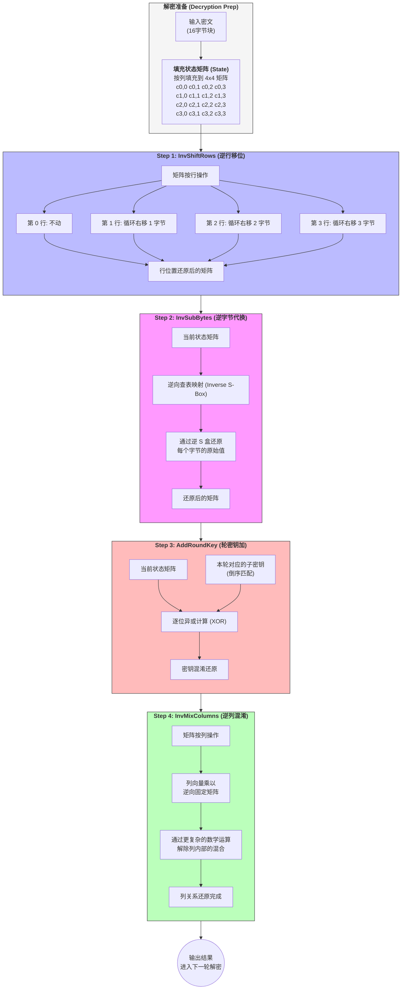
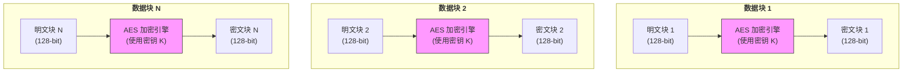
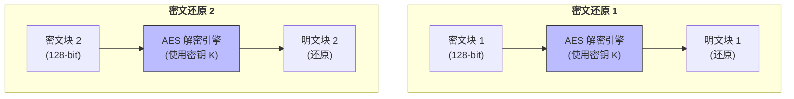
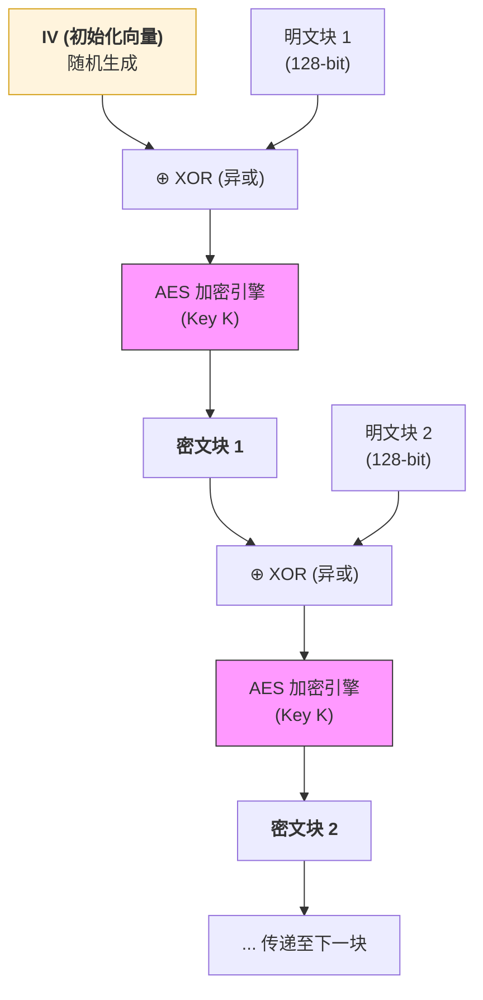
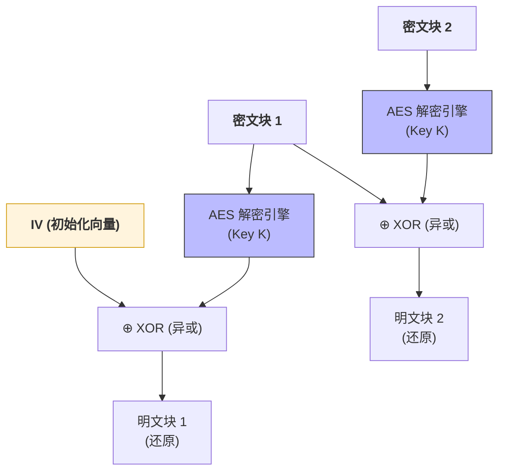
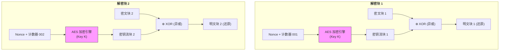

```mermaid
graph TD
    subgraph Block_1 ["<b>数据块 1</b>"]
        N1["Nonce + 计数器 001"] --> E1["AES 加密引擎<br>(Key K)"]
        E1 --> MSK1["密钥流块 1<br>(乱码)"]
        P1["明文块 1"] --> XOR1["⊕ XOR (异或)"]
        MSK1 --> XOR1
        XOR1 --> C1["<b>密文块 1</b>"]
    end

    subgraph Block_2 ["<b>数据块 2</b>"]
        N2["Nonce + 计数器 002"] --> E2["AES 加密引擎<br>(Key K)"]
        E2 --> MSK2["密钥流块 2<br>(乱码)"]
        P2["明文块 2"] --> XOR2["⊕ XOR (异或)"]
        MSK2 --> XOR2
        XOR2 --> C2["<b>密文块 2</b>"]
    end

    subgraph Block_N ["<b>数据块 N</b>"]
        NN["Nonce + 计数器 N"] --> EN["AES 加密引擎<br>(Key K)"]
        EN --> MSKN["密钥流块 N<br>(乱码)"]
        PN["明文块 N"] --> XORN["⊕ XOR (异或)"]
        MSKN --> XORN
        XORN --> CN["<b>密文块 N</b>"]
    end

    style E1 fill:#f9f,stroke:#333
    style E2 fill:#f9f,stroke:#333
    style EN fill:#f9f,stroke:#333
    style N1 fill:#fff4dd,stroke:#d4a017
    style N2 fill:#fff4dd,stroke:#d4a017
```

AES 是一种**对称密钥加密算法**。所谓“对称”，意味着加密信息和解密信息使用的是**同一把钥匙**。

三种密钥长度：

| **算法名称**    | **密钥长度 (Key Size)** | **轮数 (Rounds)** | **安全级别**   |
| ----------- | ------------------- | --------------- | ---------- |
| **AES-128** | 128 bit             | 10 轮            | 极高（商业通用）   |
| **AES-192** | 192 bit             | 12 轮            | 极高         |
| **AES-256** | 256 bit             | 14 轮            | 顶级（军方/政府级） |
## 加密过程

### 单个标准轮的内部操作

## 解密过程

解密过程和加密过程不是直接颠倒的，不过这是数学问题了。

## 工作模式
由于 AES 一次只能加密 128bit，所以出现了不同的工作模式解决这一问题。

### ECB 工作模式
ECB 是最基础的工作模式，他直接独立地处理每一个 128bit 数据。

加密过程：

解密过程：

### CBC 工作模式
与 ECB 模式不同，**CBC (Cipher Block Chaining，密码块链接)** 模式引入了一个“链式”结构。每一块明文在加密之前，必须先与前一个块的**密文**进行异或运算。

加密过程：

解密过程：

### CTR 工作模式
**CTR (Counter, 计数器模式)** 是目前最受欢迎的 AES 工作模式之一。它的设计理念非常独特：它不直接加密你的数据，而是加密一个**“计数器”**，将其变成一串随机乱码，再通过异或（XOR）运算把乱码“盖”在你的数据上。

这种设计让它从“块加密”变成了“**流**加密”，具备了极高的性能。

**Nonce** 是 **"Number used once"**（只使用一次的数字）的缩写。
加密过程：

解密过程：

#### 块加密是怎么变成流加密的？
之前的加密是直接对明文进行加密，所以就需要明文为 128bit。不过，现在 AES是对 $\text{Nonce}+\text{计数器数}$ 加密，然后再对明文进行异或，所以只需要 $\text{Nonce}+\text{计数器数}$ 满足 128bit 的要求就好了。又因为异或是可以单个位进行运算的，自然变成了流加密。

## 填充模式
由于AES需要128bit的明文，那么不足时需要填充。

需要注意的是，并不是所有工作模式都需要填充

| **模式**        | **是否需要 Padding** | **原因**                                                    |
| ------------- | ---------------- | --------------------------------------------------------- |
| **ECB / CBC** | **是**            | 它们是直接对明文块进行操作，必须对齐 16 字节。                                 |
| **CTR / GCM** | **否**            | 它们把 AES 变成了“流加密”。由于它是用乱码流和明文做异或，明文有多少字节就异或多少字节，多余的乱码直接丢弃。 |

### PKCS#7 填充
