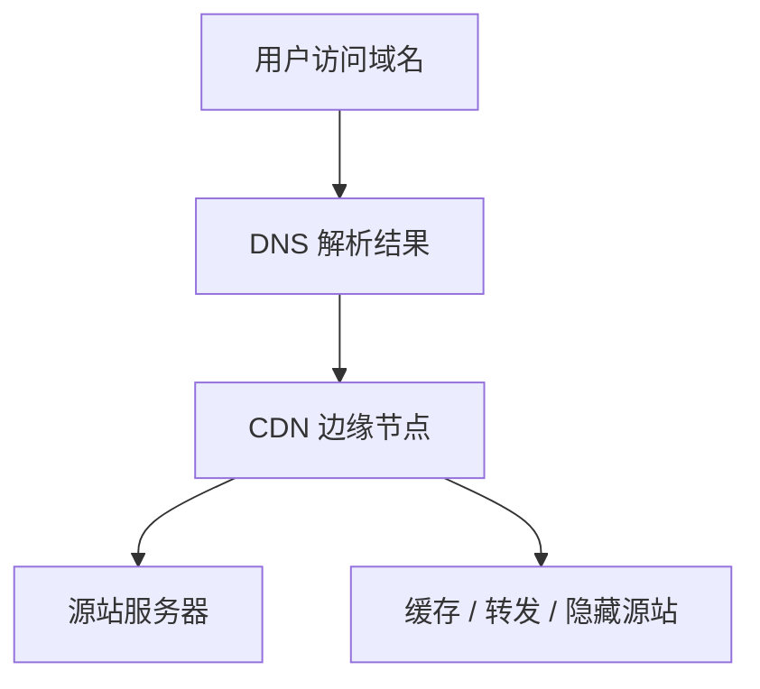
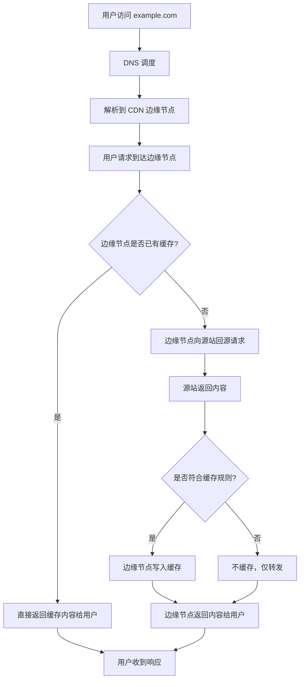

## 什么是 CDN
CDN，Content Delivery Network，内容分发网络，是一种把内容分发到多个边缘节点，由用户就近访问，并由边缘节点缓存、转发、加速和保护源站的网络服务体系。

很多时候，域名解析出来的地址只是 CDN 节点地址。这个节点负责缓存、转发、隐藏源站，并不一定就是实际承载业务的服务器。

### CDN 常见分发内容

CDN 最常见的是分发静态资源，但不代表它只能处理静态内容。更准确地说，CDN 分发的是“用户访问量大、适合边缘接入”的内容，只是不同内容的处理方式不同。

常见分发内容主要有：

- 图片、CSS、JavaScript、字体文件等静态资源。
- 视频、音频、软件安装包、补丁包、文档下载等大文件。
- 网页 HTML 内容，例如首页、新闻页、活动页。
- API 响应、接口数据、JSON 配置等动态内容。
- 直播流、点播分片、短视频切片等流媒体内容。

可以简单分成两类理解：

- 适合长期或重复缓存的内容：图片、JS、CSS、视频分片、下载包。
- 更偏转发和加速的内容：动态页面、用户个性化接口、实时 API。

例子：

- `logo.png`、`app.js` 这类资源通常很适合 CDN 缓存。
- 新闻网站首页可以做短时间缓存，比如几秒到几分钟。
- 用户订单接口、个人资料接口通常不直接缓存，但仍可能先经过 CDN 节点再回源。
- 视频平台的 `.m3u8`、`.ts`、`.mp4` 等内容也经常通过 CDN 分发。

所以实战里不要把 CDN 理解成“只缓存静态文件”，它既可以缓存内容，也可以只做边缘转发、加速和防护。

### CDN 常见作用

- 缓存静态资源，降低源站压力。
- 加速访问，就近分发内容。
- 隐藏源站，减少真实服务器直接暴露。
- 提供 WAF、DDoS 防护、证书托管、回源控制等能力。

### CDN 的工作过程

CDN 的核心不是“把网站放到别处”，而是“用户先访问边缘节点，边缘节点决定是直接返回缓存，还是再去源站取内容”。

## 判断思路

