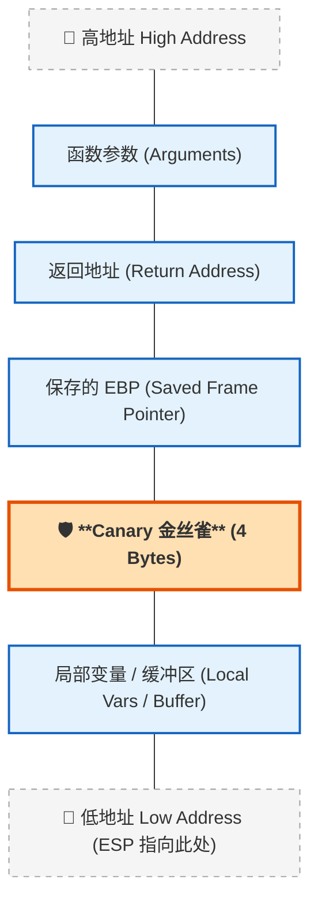

`Canary`（栈金丝雀 / Stack Canary）是一种用于**防御栈缓冲区溢出攻击**的编译器级安全保护机制。
[[canary 无PIE 有NX 格式化字符串]]
## 工作原理

当程序使用支持该保护的编译器（如 GCC 的 `-fstack-protector`）编译时，编译器会在函数的栈帧中、**缓冲区（局部变量）与返回地址（或保存的帧指针）之间**插入一个随机值，这个值就是 `Canary`。

函数执行完毕准备返回时，程序会先检查这个值是否被修改：

- ✅ **未修改**：说明栈正常，继续返回执行。
- ❌ **被修改**：说明发生了栈溢出，返回地址很可能已被覆盖。此时程序会立即调用 `__stack_chk_fail` 终止运行，阻止攻击者劫持控制流。

**一个线程内的所有栈帧，使用的都是同一个 Canary 值。**