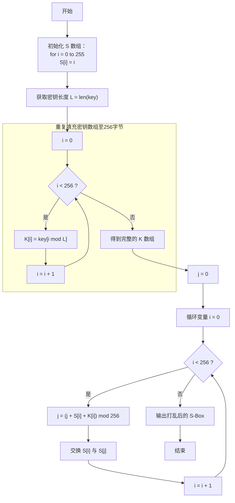
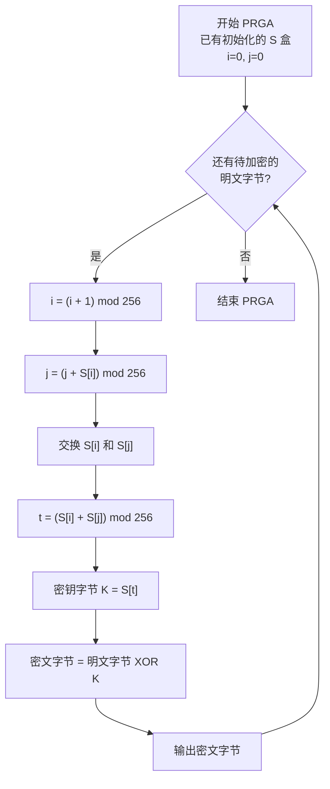

# RC4
- 是对称加密算法

## 算法过程

### KSA生成S-Box
使用给定密钥来打乱大小为 256 的 S-Box

```mermaid
flowchart TD
    A[开始] --> B["初始化 S 数组：<br/>for i = 0 to 255<br/>S[i] = i"]
    B --> C["获取密钥长度 L = len(key)"]
    
    subgraph K_init ["重复填充密钥数组至256字节"]
        D["i = 0"] --> E{"i < 256 ?"}
        E -->|是| F["K[i] = key[i mod L]"]
        F --> G["i = i + 1"]
        G --> E
        E -->|否| H[得到完整的 K 数组]
    end

    C --> D
    H --> I["j = 0"]
    I --> J["循环变量 i = 0"]
    J --> K{"i < 256 ?"}
    K -->|是| L["j = (j + S[i] + K[i]) mod 256"]
    L --> M["交换 S[i] 与 S[j]"]
    M --> N["i = i + 1"]
    N --> K
    K -->|否| O["输出打乱后的 S-Box"]
    O --> P[结束]
```

### PRGA加密明文

```mermaid
flowchart TD
    A[开始 PRGA<br>已有初始化的 S 盒<br>i=0, j=0] --> B{还有待加密的<br>明文字节?}
    B -->|是| C["i = (i + 1) mod 256"]
    C --> D["j = (j + S[i]) mod 256"]
    D --> E["交换 S[i] 和 S[j]"]
    E --> F["t = (S[i] + S[j]) mod 256"]
    F --> G["密钥字节 K = S[t]"]
    G --> H["密文字节 = 明文字节 XOR K"]
    H --> I[输出密文字节]
    I --> B
    B -->|否| J[结束 PRGA]
```
