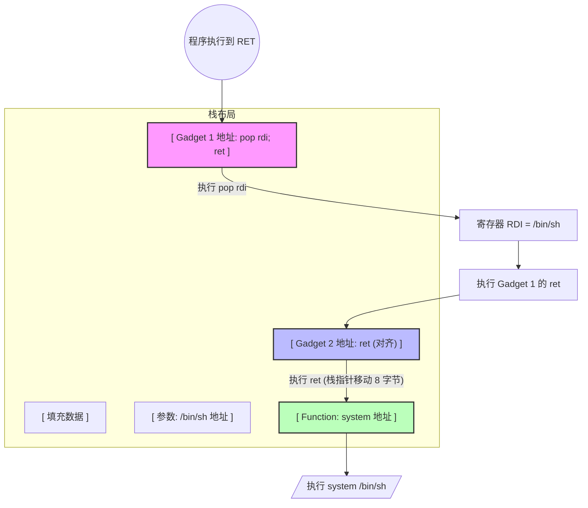

**ROPgadget** 是一款强大的二进制安全工具，主要用于在 ELF/PE/Mach-O 等格式的二进制文件中搜索 **Gadgets**（小片段指令），它是构造 ROP（Return-Oriented Programming）攻击链的核心工具。


## 基础搜索命令

最常用的操作是扫描二进制文件并列出所有 Gadgets：

Bash

```
# 扫描指定文件
ROPgadget --binary ./pwn_file

# 将结果导出到文件以便后续分析
ROPgadget --binary ./pwn_file > gadgets.txt
```

## 常用过滤与精确定位

由于二进制文件生成的 Gadget 数量可能非常庞大，过滤是必不可少的。

### 📌 按指令内容过滤 (`--only`)

只显示包含特定指令（如 `pop` 或 `ret`）的 Gadget：

Bash

```
# 只寻找含有 pop 和 ret 的指令
ROPgadget --binary ./pwn_file --only "pop|ret"
```


> [!NOTE] 例子
> ```
> # 只保留包含 pop 和 ret 的 Gadget
ROPgadget --binary ./pwn --only "pop|ret"
> ```
> **输出示例：** 
> `0x0000000000400683 : pop rdi ; ret`
>  `0x0000000000400681 : pop rsi ; pop r15 ; ret`

### 📌 使用 grep 进行二次搜索

配合 Linux 的 `grep` 可以极大地提高效率：

Bash

```
# 寻找控制 rdi 寄存器的 Gadget（常用于 x64 传参）
ROPgadget --binary ./pwn_file | grep "pop rdi"

# 寻找用于栈对齐的单纯 ret 指令
ROPgadget --binary ./pwn_file | grep " : ret$"
```

### 📌 限制 Gadget 长度 (`--depth`)

有时候为了缩短 ROP 链，需要限制指令的数量：

Bash

```
# 只搜索长度在 5 条指令以内的 Gadget
ROPgadget --binary ./pwn_file --depth 5
```

## 高级功能

### 🔍 寻找字符串 (`--string`)

在二进制文件中寻找特定字符串（如 `/bin/sh`）：

Bash

```
ROPgadget --binary ./pwn_file --string "/bin/sh"
```

###  排除坏字符 (`--badbytes`)

如果漏洞利用过程中存在坏字符限制（如 `\x00`），可以自动过滤掉包含这些字符的 Gadget 地址：

Bash

```
# 排除地址中包含 00 或 0a 的 Gadget
ROPgadget --binary ./pwn_file --badbytes "00|0a"
```

### 🤖 自动生成 ROP 链 (`--ropchain`)

对于一些简单的环境，ROPgadget 可以尝试自动生成一段 Python Exploit 代码片段：

Bash

```
# 尝试自动构建获取 shell 的 ROP 链
ROPgadget --binary ./pwn_file --ropchain
```

## 💡 ROP 执行逻辑示意图

为了理解为什么我们需要这些 Gadget，可以参考以下 ROP 链的执行流程：

代码段



---

### 💡 技巧提示

- **管道符活用**：由于 ROPgadget 默认输出带颜色，如果 `grep` 没反应，可以尝试加上 `--no-color`。
- **寻找 syscall**：在寻找系统调用相关的 Gadget 时，直接搜索 `syscall` 或 `int 0x80` 往往是关键。