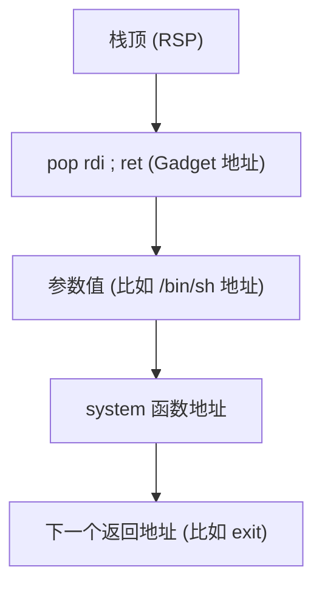

在 64 位 Linux 系统中，函数调用遵循 **System V AMD64 ABI**。与 32 位（x86）完全靠栈传递参数不同，64 位由于寄存器变多了，效率大大提高。

## 1. 核心规则：寄存器传参

前 **6** 个参数优先使用寄存器传递，剩下的参数才丢到栈上。

|**参数次序**|**寄存器**|**记忆口诀 (或巧记)**|
|---|---|---|
|第 1 个|**RDI**|**D**iane's|
|第 2 个|**RSI**|**S**ilk|
|第 3 个|**RDX**|**D**ress|
|第 4 个|**RCX**|**C**osts|
|第 5 个|**R8**|**8**|
|第 6 个|**R9**|**9**|

- **返回值**：通常存储在 **RAX** 中。
- **第 7 个及后续参数**：从右向左依次压入栈中。

---

## 栈帧结构与对齐 (Stack Alignment)

这是 Pwn 掉坑里频率最高的地方：、

- **16 字节对齐**：在执行 `call` 指令**之前**，栈顶指针 `RSP` 必须是 16 字节对齐的（即 $RSP \pmod{16} = 0$）。
    
- **Call 的影响**：执行 `call` 指令时，CPU 会把返回地址（8 字节）压入栈中。这意味着进入函数内部后，栈顶变成了 $RSP \pmod{16} = 8$ 的状态。
    
- **为什么 Pwn 会崩？**：现代 Linux 库函数（如 `system`）内部使用了 `MOVAPS` 指令优化性能，该指令要求操作的内存必须 16 字节对齐。如果你的 ROP 链让栈乱了，没对齐，程序就会触发 `SIGSEGV`。
    

---

## 函数调用的汇编三部曲

### 第一步：传递参数 (Caller)

代码段

```
mov rdi, 0x1       ; 第一个参数
mov rsi, 0x2       ; 第二个参数
call some_function ; 调用函数（自动压入返回地址）
```

### 第二步：建立与销毁栈帧 (Callee)

现代编译器通常会优化掉 `ebp`，但标准流程如下：

代码段

```
push rbp           ; 保存旧基址
mov rbp, rsp       ; 设置当前基址
sub rsp, 0x20      ; 开辟局部变量空间
...
leave              ; 相当于 mov rsp, rbp; pop rbp
ret                ; 弹出返回地址到 RIP
```

### 第三步：获取返回值 (Caller)

代码段

```
; 函数执行完后
cmp rax, 0         ; 检查 RAX 里的返回值
```

---

## 寄存器分类 (保存责任)

- **调用者保存 (Caller-saved)**：`RAX`, `RCX`, `RDX`, `RSI`, `RDI`, `R8-R11`。
    - 这些寄存器在函数调用后可能被修改，如果你之后还要用，调用前得自己先存起来。
        
- **被调用者保存 (Callee-saved)**：`RBX`, `RSP`, `RBP`, `R12-R15`。
    - 函数必须保证在退出时，这些寄存器的值和进来时一模一样。

---

## Pwn 视角下的逻辑图

当你构造 ROP 链时，你实际上是在模拟这个过程：

代码段




---

### 💡 避坑总结

1. **32位 vs 64位**：32 位看栈，64 位看寄存器。
2. **传参顺序**：RDI -> RSI -> RDX -> RCX -> R8 -> R9。
3. **对齐大法**：如果 ROP 链调用 `system` 莫名其妙崩了，在 ROP 链开头或中间塞一个单纯的 `ret` 指令地址，通常就能顺好 16 字节对齐。