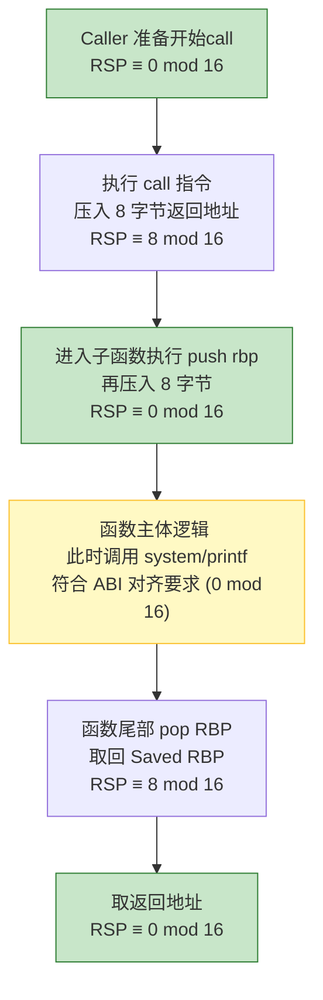
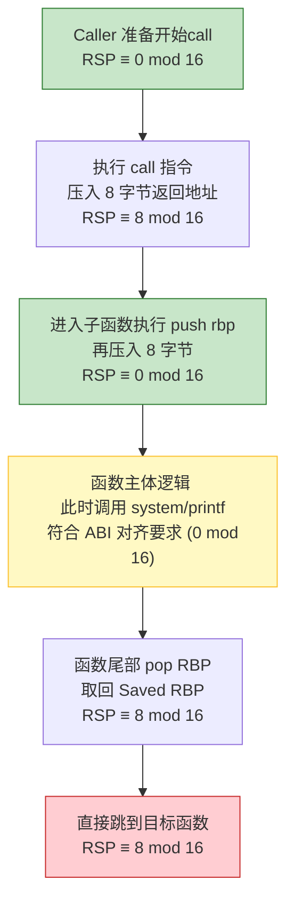

**System V AMD64 ABI** 标准要求 `call` 函数的时候，栈指针要对齐16字节（$RSP \equiv 0 \pmod{16}$）

所以我们可以知道，进入一个函数开始执行的时候，栈是对齐的。

`call` 不仅会跳转，还会把下一条指令的返回地址压入栈，此时
$$RSP \equiv 8 \pmod{16}$$

然后，进入函数，每个函数都会保存栈底 `RBP`，所以此时栈又对齐了
$$RSP \equiv 0 \pmod{16}$$

当函数执行完之后，之前的操作肯定是对称的，所以此时依然是$RSP \equiv 0 \pmod{16}$。
最后 `RBP` 被 pop，返回地址也被 pop，进行了两次操作，依然是对齐的。

## 但是，栈溢出的时候，栈的对齐会出问题
当我们直接 `ret` 到目标函数的时候，没有 `call` 指令，也就没有讲 `RSP` 压入栈的过程。
那么正常指令的栈平衡就被打破了。

通常的解决办法是，在 `ret` 到目标函数之前，再ret到另外一个函数（通常尽可能短小，以减少影响），这样不平衡的操作进行了两次，就变成平衡了。

