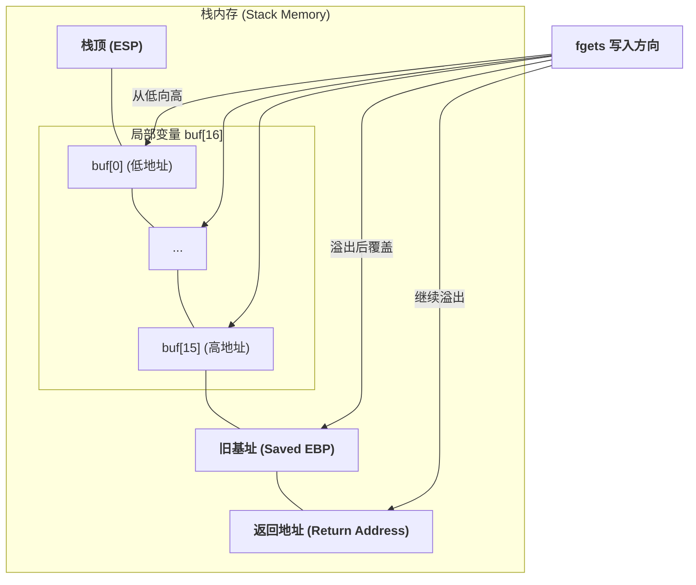

---
tags:
  - CTF
---

## 基本描述

以下是以 x86 架构（32位）为例的典型栈变化过程，x64 架构原理类似，只是参数通常优先通过寄存器传递。

栈的生长方向是高地址到低地址（所以sub实际上是开辟栈空间，add则是缩减栈空间）

**栈溢出能修改返回地址，也能修改参数。这意味着栈溢出既能调用函数又能传参。**

函数调用栈布局示意图：

```mermaid
graph TD
    subgraph "栈内存布局 (Stack Layout)"
        A["`**高地址 (High Address)**`"]
        B["`参数 N (Argument N)`"]
        C["`...`"]
        D["`参数 1 (Argument 1)`"]
        E["`**返回地址 (Return Address / saved EIP)**`"]
        F["`**旧的基址指针 (Saved EBP / SFP)**`"]
        G["`局部变量 1 (Local Variable 1)`"]
        H["`局部变量 2 (Local Variable 2)`"]
        I["`**栈顶 (Current ESP)**`"]
        J["`**低地址 (Low Address)**`"]

        A --- B
        B --- C
        C --- D
        D --- E
        E --- F
        F --- G
        G --- H
        H --- I
        I --- J
    end
```


`fgets` 的写入方向是低地址到高地址：


## 什么时候，栈溢出能够使用？

> [!check] 例子1
> 函数内部，`x32`
> ```asm
> push    ebp          ; 保存父函数的栈基址
> mov     ebp, esp     ; 设置当前函数的栈基址
> sub     esp, 0x48    ; 在栈上开辟 0x48 (72字节) 的空间
> ...
> lea     eax, [ebp-0x40] ; 将缓冲区起始地址存入 EAX
> push    eax             ; 作为第一个参数压栈
> call    _gets           ; 【致命】gets 不知道缓冲区只有 0x40 这么大
> ...
> leave                ; 相当于 mov esp, ebp; pop ebp
> ret                  ; 弹出栈顶的值到 EIP
> ```

这是个很标准的函数，开始前保存 `ebp` 然后设置新栈基址 `ebp` 接着开辟栈空间，最后尾部 `mov esp, ebp` 把开辟的栈空间收回，又把 `ebp` 还原。

我们可以利用 `_gets` 来覆写 `ebp+4` ，也就是返回地址，程序运行到结尾的时候，`esp` 为之前保存的 `ebp` ，此时 `pop` 就会取出我们覆写的地址。

## 什么时候栈溢出没法用？

> [!fail] 反例
> 函数内部，`x32`， 栈对齐，只有一个不限制大小的输出，和一个 `printf(format)`，只会执行一次
> ```asm
> ; --- 函数开头 (Prologue) ---
> lea     ecx, [esp+4]         ; 将原始栈指针存入 ecx
> and     esp, 0FFFFFFF0h      ; 强制 16 字节对齐，esp 此时会向下跳到一个新位置
> push    dword ptr [ecx-4]    ; 将原始返回地址压入对齐后的栈，实际上用不到，给调试器看的
> push    ebp                  ; 保存老 ebp
> mov     ebp, esp             ; 设置新 ebp
> push    ebx
> push    ecx                  ; 【关键】将 ecx (原始栈指针) 备份在栈上 [ebp-8] 的位置
> ...
> ; --- 函数结尾 (Epilogue) ---
> lea     esp, [ebp-8]         ; 让 esp 指向备份 ecx 的地方
> pop     ecx                  ; 【致命】从栈上弹回原始指针到 ecx
> pop     ebx
> pop     ebp
> lea     esp, [ecx-4]         ; 【陷阱】利用 ecx 恢复真正的栈顶
> retn                         ; 弹出 esp 指向的地址到 EIP
> ```

^b61420

在这里，编译器进行了栈对齐的优化，因为对齐会改变 esp 的值，所以不仅要保存 `ebp` 还要保存 `esp`。
由于 `esp` 也保存在栈里，我们覆写的时候，肯定也会把保存的 `esp` 给覆写了，这会导致弹出返回地址的时候就不是我们的覆写地址了。
这有点类似于 **金丝雀Canary**，攻破金丝雀的方法是我们能泄露出 Canary 的值，然后再覆写回去。
这里只会执行一次，即使我们用 `printf` 泄露了值，下一次他又改变了。
