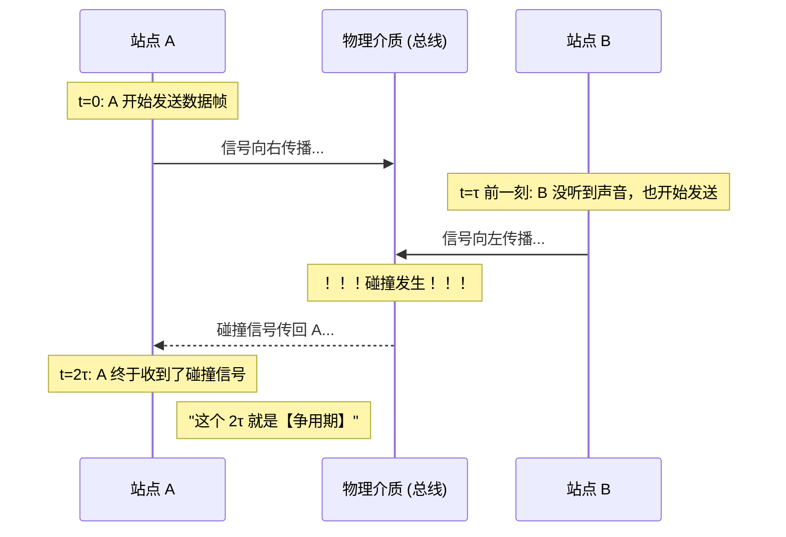

### CSMA/CD
- **CS (Carrier Sense) 载波监听：** 发言前先听一下。如果有人在说话，我就闭嘴等一会。
- **MA (Multiple Access) 多路访问：** 大家都在同一个“屋子”（总线）里，谁都有机会发言。
- **CD (Collision Detection) 碰撞检测：** 边说边听。如果我说话的同时发现别人也在说，说明“撞车”了，立刻停止发言。

### 争用期
假设信号从 A 传到 B 需要的时间是 $\tau$，那么争用期就是 $2 \tau$。
为什么是 $2\tau$ ？考虑极端情况：A刚把信号传到B，B就开始发了

### 最短帧长
任何一个数据包（帧）的“说话时长”，必须**大于等于**信号往返的时间（争用期）。
由此得来的数据包，就是最短帧长。

- **成功案例：** 帧足够长，A 还在发，碰撞信号就回来了。
- **失败案例：** 帧太短了，A 说完了，碰撞信号才回来。

```mermaid
gantt
    title 最短帧长逻辑对比
    dateFormat  X
    axisFormat %s
    
    section 场景一：长帧 (成功检测)
    发送数据 (正在说话)    :active, a1, 0, 80
    检测到碰撞信号 (2τ)    :milestone, m1, 51, 0
    停止发送并重传       :crit, 52, 20

    section 场景二：短帧 (检测失败)
    发送数据 (说完闭嘴了)  :a2, 0, 30
    检测到碰撞信号 (2τ)    :milestone, m2, 51, 0
    误以为发送成功        :done, 31, 50
```

---

---

> [!question]
> 在传统的 10 Mbps 以太网中，规定的“争用期”（碰撞窗口）是多少微秒？它对应的比特时间是多少？以太网规定的最短帧长是多少字节？

- 争用期是规定的 $51.2\mu s$
计算出输送单个比特到链路所需要的时间 $=\frac{1}{带宽}=10^{-7}s=0.1\, \mu s$

- 我们就可以计算出 $比特时间=\frac{51.2}{r}=512\, bit$

我们已经算出了最短帧长的比特数量，字节数量就好算了
- $\text{最短帧长} = \frac{512 \text{ bits}}{8 \text{ bits/Byte}} = 64 \text{ Bytes}$

> [!question]
> 为什么以太网必须要规定一个“最短帧长”？如果一个站点发送的数据帧长度小于规定的最短帧长，会有什么后果？

因为信号不能同时发，否则会叠加产生畸变。

核心目的是**在信号没发完的时候，能够收到别人发的信号，从而检测出碰撞。**
如果帧长过短，会出现已经把信号发完了，才收到别人发的信号，此时信号没有叠加，检测不出碰撞。
如果检测不出碰撞，收到的就是叠加后的畸形信号，并误以为这是正常数据。

> [!question]
> 在使用 CSMA/CD 协议的以太网中，如果一个站点在发送数据的过程中，平稳度过了“争用期”而没有检测到任何碰撞，这是否意味着该帧在后续的传输过程中也绝对不会发生碰撞？为什么？

是的，这意味着所有站点都知道这个站点在发送信号了，就不会发送信号了。

为什么不是平稳度过 $\tau$ ？因为别人的数据可能也在发，所以这不能保障没发生碰撞。
而平稳度过了 $2r$ ，这证明在这期间，没有任何其他人发送数据，没有发生碰撞，并且他们也都知道你在发消息了，其他人也不会想着重传什么的了。

> [!question]
> 在一个长度为 $1\text{ km}$ 的 CSMA/CD 局域网中，信号在电缆中的传播速度为 $200,000\text{ km/s}$。如果该网络的数据传输速率为 $1\text{ Gbps}$（$10^9\text{ bps}$），试求为了保证 CSMA/CD 协议正常工作，能够使用的**最短帧长**是多少字节？

先计算信号的单程时间 $\tau = \frac{1\, \text{km}}{200,000\, \text{km/s}}=5\times 10^{-6} \, \text{s} = 5 \, \mu s$
那么争用期为 $$2\tau = 2 \times 5\,\mu s = 10\,\mu s$$
然后我们计算争用期这个时间内能输送多少比特到链路上
$$L_{min}(\text{bits}) = \text{带宽} \times 2\tau = 10^9\text{ bps} \times (10 \times 10^{-6}\text{ s}) = 10,000\text{ bits}$$
换算成字节
$$L_{min}(\text{bytes}) = \frac{10,000\text{ bits}}{8\text{ bits/Byte}} = \mathbf{1,250\text{ Bytes}}$$

> [!question]
> 某 10 Mbps 的以太网中，信号在媒体上的传播速度为 $2 \times 10^8\text{ m/s}$。假设为了兼容现有硬件，网络的最短帧长固定为 64 字节。试问该以太网所允许的**最大端到端物理距离**（即两个最远站点之间的距离）理论上是多少米？

$$
\begin{aligned}
最短帧长&=2\tau \times 传输速度 \\
最短帧长&=2\frac{两端距离}{传播速度}\times传输速度\\
两端距离&=\frac{最短帧长\times传播速度}{2\times传输速度}\\
两端距离&=\frac{64\times8\times2\times10^8}{2\times10\times10^6} \\
两端距离&= 5120 \, \text{m}
\end{aligned}

$$

