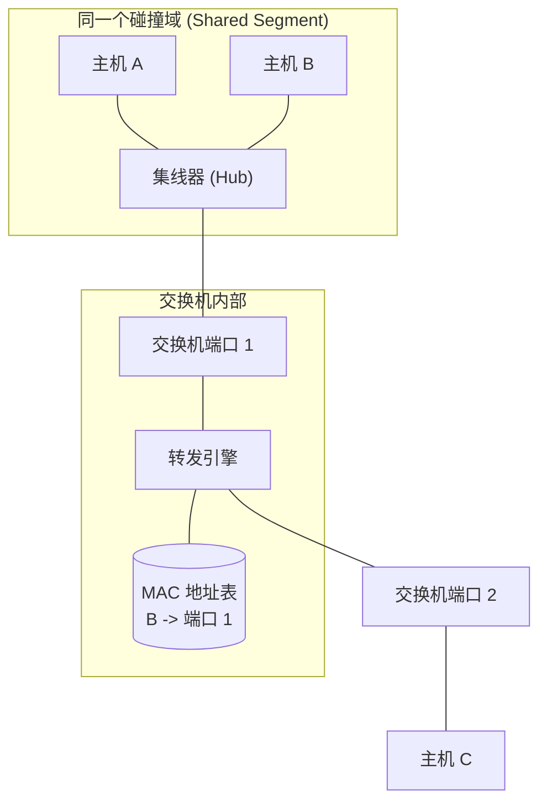

交换机内部维护着一张表格，最开始的时候是空的，一般来说长这样：

| **VLAN** | **MAC Address** | **Type** | **Port**            |
| -------- | --------------- | -------- | ------------------- |
| 1        | 0050.56c0.0001  | DYNAMIC  | FastEthernet 0/1    |
| 1        | 000c.296b.f3c2  | DYNAMIC  | FastEthernet 0/2    |
| 10       | 00e0.fc12.3456  | STATIC   | GigabitEthernet 0/1 |
| 1        | 0015.5d01.0a22  | DYNAMIC  | FastEthernet 0/3    |

- 静态是手动添加的，永远不会过期。
- 动态的，过一段时间没有消息传递就会自己消失。

实际是怎么运作的呢？
- 如果收到的数据包目标mac在表里并不存在，交换机会进行泛洪。有人回应的话就会在表里学到这个目标MAC。
	- 什么时候主机会回应？如果协议要求主机收到请求要回应（比如ping），那么交换机就可以学到该主机的MAC
- 如果有，就直接匹配直接发。

---

> [!question]
> 以太网交换机建立和维护 MAC 地址表（交换表）的基本工作原理可以用“学习_______，转发_______”来概括。当交换机收到一个帧时，它是根据帧首部中的哪一个信息来更新自己的 MAC 表的？

学习源MAC地址，转发目的MAC地址

> [!question]
> 当交换机收到一个单播数据帧时，如果在其 MAC 地址表中没有查找到该帧的目的 MAC 地址，交换机会认为这是一个无效帧并将其丢弃。请判断对错，并说明理由。

错，在表中找不到，会进行泛洪。

> [!question]
> 交换机在接收到数据帧后，在什么样的情况下会对该数据帧执行“过滤（丢弃）”操作？请举例说明。

当交换机查表后发现，**该数据帧的目的 MAC 地址所对应的转发端口，与接收该数据帧的端口是同一个端口时**，执行丢弃操作。

举例：集线器连接了主机 A 和 B，且集线器连接在交换机的端口 1 上。当 A 发帧给 B 时，帧到达交换机端口 1。交换机查表发现目标 B 也应该从端口 1 转发出去，这就意味着 A 和 B 在同一个物理网段，B 已经通过集线器直接收到了，交换机没必要再把帧从端口 1 弹回去，因此直接过滤（丢弃）该帧。



> [!question]
> 如果交换机从端口 1 收到了一个源地址为 MAC_A，目的地址为 `FF-FF-FF-FF-FF-FF`（全1）的广播数据帧。 (1) 交换机会如何转发这个帧？ (2) 交换机的自学习机制还会记录这个帧的源地址吗？

（1）
给除了端口1的所有端口转发该帧

（2）
这个目的地址是广播地址，但源地址不是，所以仍然会学习源MAC地址。

> [!question]
> 假设主机 A 正常连接在交换机 SW 的端口 1 上，且 SW 的 MAC 表中已经记录了 `(MAC_A, 端口1)`。现在网络管理员将主机 A 的网线拔下，直接插到了 SW 的端口 3 上，随后主机 A 立即向外发送了一个数据帧。请问交换机 SW 的 MAC 地址表会发生怎样的变化？

交换机会立即更新。`(MAC_A, 端口1)` 会变成 `(MAC_A, 端口3)`

> [!question]
> 主机 A 连接在交换机 SW1 的端口 1，SW1 的端口 3 通过网线连接到交换机 SW2 的端口 1。主机 B 连接在 SW2 的端口 2。假设两台交换机的 MAC 表初始都为空。 当主机 A 向主机 B 发送一个单播帧时，SW1 和 SW2 的 MAC 地址表中分别会增加哪条记录？

SW1 会增加 
- `(MAC_A, 端口1)`
SW2 会增加 
- `(MAC_A, 端口1)`

注意源MAC没改变。


> [!question]
> 主机 A（MAC地址为 A）、B（MAC地址为 B）、C（MAC地址为 C）分别连接在一台以太网交换机的端口 1、2、3 上。假设交换机的 MAC 地址表初始为空。现在发生以下三次通信过程：
> ① 主机 A 发送一个帧给主机 B。
> ② 主机 C 发送一个帧给主机 A。
> ③ 主机 B 发送一个帧给主机 A。
> 请分别描述这三步操作中，交换机收到帧后的“学习动作”和“转发动作”。
> ```mermaid
> graph LR
>     subgraph "以太网交换机 (Switch)"
>     P1["`端口 1`"]
>     P2["`端口 2`"]
>     P3["`端口 3`"]
>     end
> 
>     A["`主机 A (MAC: A)`"] --- P1
>     B["`主机 B (MAC: B)`"] --- P2
>     C["`主机 C (MAC: C)`"] --- P3
> ```

- ①
	- 学习动作：学到 `(MAC_A, 端口1)`
	- 转发动作：泛洪转发给端口2、端口3
- ②
	- 学习动作：学到 `(MAC_C, 端口3)`
	- 转发动作：单播转发给端口1
- ③
	- 学习动作：学到 `(MAC_B, 端口2)`
	- 转发动作：单播转发给端口1
