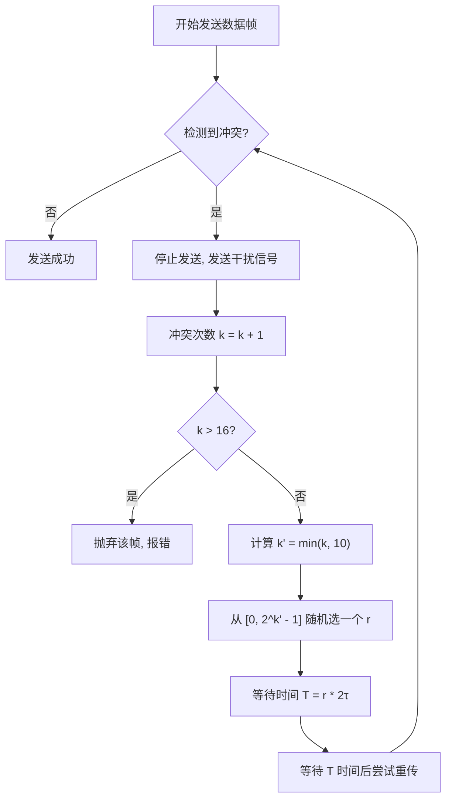

**截断二进制指数退避算法（Truncated Binary Exponential Backoff Algorithm）** 是计算机网络中处理“冲突”的一种核心机制，主要应用于以太网的 **CSMA/CD（载波监听多路访问/冲突检测）** 协议中。

简单来说，当两个节点在同一时间发送数据导致“撞车”（冲突）时，这个算法决定了它们各自应该**等待多久**再尝试重新发送。

---

### 核心工作原理

该算法通过动态调整等待时间的范围，来降低再次发生冲突的概率。其具体步骤如下：

1. **确定基本退避单位**：
    规定争用期（Contention Slot Time）为 $2\tau$（通常为 51.2 微秒，对应 10Mbps 以太网中的 512 位传输时间）。
    
2. **设定冲突计数器**：
    记录该帧发生的冲突次数，记为 $k$。
    
3. **计算随机数范围**：
    根据冲突次数计算一个参数 $k'$，公式为：$k' = \min(k, 10)$。
    这意味着当冲突次数超过 10 次后，$k'$ 不再增加，始终等于 10。
    
4. **选取随机数**：
    从整数集合 $[0, 1, 2, \dots, (2^{k'} - 1)]$ 中随机选取一个整数 $r$。
    
5. **计算等待时间**：
    退避时间（等待时间） $T = r \times 2\tau$。
    
6. **尝试重传或放弃**：
    - 如果重传再次冲突，$k$ 加 1，重复上述步骤。
    - 如果连续冲突 **16 次** 仍未成功，说明网络拥塞严重，此时丢弃该帧并向高层协议报错。

---

### 为什么叫“截断”和“指数”？

- **指数（Exponential）**：随着冲突次数 $k$ 的增加，随机数选取的范围上限按 $2^k$ 呈指数级增长。这能迅速拉开不同节点之间的等待时间，有效分散流量。
    
- **截断（Truncated）**：为了防止等待时间无限制地膨胀，算法在 $k=10$ 时“截断”了上限。此时最大随机数为 $2^{10} - 1 = 1023$。
    

---

### 算法流程图

我们可以通过以下逻辑直观了解其运行过程：

---

### 它的精妙之处
- **自适应性**：如果网络负载很轻，冲突少，$r$ 的取值范围小，重传就快。
- **冲突退散**：如果网络拥塞，冲突频繁，取值范围迅速扩大，节点们会自觉地“排队”并错开发送时间。

---

> [!question]
> 在截断二进制指数退避算法中，退避时间是基本退避时间（争用期 $2\tau$）的 $r$ 倍。请写出确定参数 $k$ 的公式，并说明 $r$ 的取值范围。

$k = \min(\text{重传次数}, 10)$
$r \in [0,2^k)$ 从这些正整数中，随机取一个。

> [!question]
> 为什么该算法被称为“截断”二进制指数退避算法？“截断”体现在算法的哪两个具体规则上？

- $k$最大为10，$r$最大为 $2^{10}-1$
- 重传次数最多为16

> [!question]
> 在以太网中，如果一个数据帧连续多次发送失败，最多允许重传多少次？如果达到了这个最大次数仍然失败，适配器会如何处理？

- **最多重传：** 16 次。
- **处理方式：** 丢弃该帧，并向高层（网络层）报告发送失败。

> [!question]
> 某站点发生了第 3 次碰撞，正在执行退避算法。请问它能选择的随机数 $r$ 的集合是什么？该站点可能等待的最大退避时间是多少个争用期？

- $r \in (0,2^3]$
- 最多是 $2^3-1=7$ 个争用期

> [!question]
> 某站点在发送数据时发生了第 11 次碰撞。请问此时参数 $k$ 的值是多少？它共有多少种退避时间的选择？

- $k = \min(碰撞次数,10) = 11$
- 有 $2^{10}$ 种选择